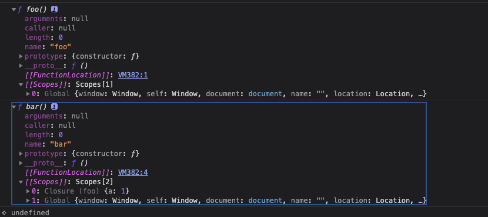

# JavaScript 闭包

## 闭包是什么

> MDN 介绍：一个函数和对其周围状态（词法环境）的引用捆绑在一起，这样的组合就是闭包。也就是说，闭包可以让一个内层函数访问到其外层函数的作用域。
> 在 JavaScript 中，每当创建一个函数，闭包就会在函数创建的同时被创建出来。

## 回顾 JS 代码运行的各个阶段

JS 是弱类型语言，在运行时才能确定变量类型。即使是 TS，也只是增加了编译时的类型检测。

> 编译器在编译过程中会进行词法分析、语法分析、语义分析、生成 AST 等处理。

同样的，JS 引擎在执行 JS 代码时，也会从上到下进行词法分析、语法分析、语义分析等处理，并在代码解析完成后生成 AST，最后根据 AST 生成 CPU 可以执行的 机器码 并执行。

以 V8 引擎为例，JS 代码的运行过程主要分为三个阶段：
1. 词法分析阶段。对代码做语法分析，检查语法，发现错误会在控制台抛出异常并终止执行。
2. 编译阶段。创建执行上下文，包括创建词法环境、创建变量对象、建立作用域链、确定 this 指向并绑定 this 等。每进入一个不同的运行环境时，V8 都会创建一个新的执行上下文。
3. 执行阶段。将编译阶段创建的执行上下文压入调用栈，并成为正在运行的执行上下文，代码执行结束后，将其弹出调用栈。

重点介绍编译阶段的核心：执行上下文的创建

### 执行上下文的创建

JS 的运行环境包括 全局执行上下文、函数执行上下文、eval 执行上下文。

全局执行上下文、函数执行上下文的创建过程如下：
- 第一次载入 JS 代码时，首先会创建一个全局环境。位于最外层，直到应用程序退出后（关闭浏览器和网页）才会被销毁。
- 每个函数都有自己的运行环境，当函数被调用时，则会进入函数的运行环境。当该环境中的代码全部被执行后，该环境移出调用栈被销毁。每次调用函数都会生成一个新的函数环境。

不同的运行环境中，变量和函数可访问的其他数据范围不同，环境的行为也有区别。

每进入一个不同的运行环境时，JS 都会创建一个新的执行上下文，该过程包括：
- 创建变量对象 VO
- 建立作用域链
- 确定 this 指向

#### 创建变量对象

变量对象：每个执行上下文中都拥有一个 关联的变量对象，保存着这个上下文中的所有变量和函数。

浏览器中，全局的变量对象是 window 对象；Node 中则是 global 对象。

创建变量对象将会创建 arguments 对象，同时会检查当前上下文的函数声明和变量声明。
- 对于变量声明：此时会给变量分配内存，并初始化为 undefined。（编译阶段只进行声明，执行阶段才进行赋值）
- 对于函数声明：在内存中创建函数对象，并直接初始化为该函数对象。

函数声明提升优先于变量声明提升。

JS 怎么支持块级作用域的？

JS 采用的是词法作用域，也就是静态作用域。

词法作用域中的变量，在编译过程中会产生一个确定的作用域，这个作用域就是当前的执行上下文，在 ES5 之后我们使用词法环境代替作用域描述该执行上下文。

因此，词法环境可理解为我们常说的作用域，同样也指向当前的执行上下文。

词法环境又分为 词法环境 LE 和变量环境 VE 两种。

- 变量环境用来记录 var、function 等变量声明
- 词法环境用来记录 let、const、class 等变量声明

创建变量过程中会进行函数提升和变量提升，JS 通过词法环境来记录函数和变量声明，通过使用两个词法环境记录不同的变量声明内容，JS 实现了支持块级作用域的同时，不影响原有的变量声明和函数声明。

这就是创建变量的过程，它属于执行上下文创建的一环。

创建变量的过程也会产生作用域，作用域也被称为词法环境，那么词法环境是由什么组成的呢？

#### 建立作用域链

词法环境是由两个成员组成的
- 环境记录：用于记录自身词法环境中的变量对象
- 外部词法环境引用：记录外层词法环境的引用

而通过外部词法环境的引用，作用域可以层层拓展，建立起从里到外延伸的一条作用域链。当某个变量无法通过自身词法环境记录中找到时，可以根据外部词法环境引用向外层进行寻找，直到最外层的词法环境中外部词法环境引用为 null，这便是作用域链的变量查询。

JS 是如何通过外部词法环境引用来创建作用域的？

JS 代码运行过程分为定义期 和 执行期。定义期即编译阶段，执行期即执行阶段。

```javascript
function foo() {
  console.dir(bar)
  var a = 1
  function bar() {
    a = 2
  }
}

console.dir(foo)

foo()
```

上述例子中，全局函数 foo 创建了一个 foo 的 [[scope]] 属性，包含了全局 [[scope]]：

```javascript
foo[[scope]] = [globalContext]
```

当执行 foo() 时，也会分别进入 foo 函数的定义期和执行期。

foo 函数的定义期，函数 bar 的 [[scope]] 将会包含全局 [[scope]] 和 foo 的 [[scope]]:

```javascript
bar[[scope]] = [fooContext, globalContext]
```



可以看到：
- foo 的 [[scope]] 属性包含了 全局的 [[scope]]
- bar 的 [[scope]] 包含了全局的 [[scope]] 和 foo 的 [[scope]]

也就是说，JS 会通过外部词法环境引用来创建变量对象的一个作用域链，从而保证对执行环境有权访问的变量和函数的有序访问。

前面说过，编译阶段会创建变量对象 VO，该过程会进行函数声明和变量声明，变量的值会被赋值为 undefined。在代码进入执行阶段之后，JS 会对变量进行赋值，此时变量对象会转为活动对象 AO，转换后的对象才可被访问，这就是 VO -> AO 的过程。

举个例子

```javascript
function foo(a) {
  var b = 2
  function c() {}
  var d = function() {}
}

foo(1)
```

在执行 foo(1) 时，首先进入定义期，此时：
- 参数变量 a 的值为 1
- 变量 b 和 d 初始化为 undefined
- 函数 c 创建函数并初始化

```javascript
VO = {
  arguments: {
    0: 1,
    length: 1
  },
  a: 1,
  b: undefined,
  c: reference to function c(){},
  d: undefined
}
```

进入执行期后，会执行赋值语句进行赋值，此时 b 和 d 被赋值为 2 和 函数表达式

```javascript

AO = {
  arguments: {
    0: 1,
    length: 1
  },
  a: 1,
  b: 2,
  c: reference to function c(){},
  d: reference to FucntionExpression 'd'
}
```

这就是 VO -> AO 过程。

- 在定义期（编译阶段）：该对象值仍为 undefined，且处于不可访问的状态
- 进入执行期（执行阶段）：VO 被激活，其中变量属性会进行赋值

```javascript
AO = VO + 'function parameters' + arguments
```

总结：
- 在编译阶段，JS 在创建执行上下文的时候会先创建变量对象 VO
- 在执行阶段，变量对象 VO 被激活为活动对象 AO，函数内部的变量对象通过外部词法环境的引用创建作用域链

#### 引出闭包

当函数执行结束后，执行期上下文将会被销毁（作用域链和活动对象均被销毁）。
有时我们想保留其中一些变量对象，不想被销毁，此时就会使用到闭包。

前面我们知道，通过作用域链，我们可以在函数内部直接读取外部以及全局变量，但外部环境是无法访问内部函数里的变量的，如下：

```javascript
function foo() {
  var a = 1
}

foo()

console.log(a) // undefined
```

因为全局环境的作用域链中，不含有函数 foo 内的作用域。

此时我们可以通过函数 foo 中的函数 bar 返回变量 a，并将 bar 函数返回，这样就可以实现在外部环境访问内部函数的变量 a：

```javascript
function foo() {
  var a = 1
  function bar() {
    return a
  }
  return bar
}

var b = foo()

console.log(b()) // 1
```

前面说到，当函数执行结束后，执行期上下文将会被销毁，其中包括作用域链和活动对象。那么，当 b() 执行时，foo 函数上下文已经全部销毁了，为什么 foo 作用域下的 a 还能被访问到呢？

因为 bar 函数引用了 foo 函数变量对象中的值，此时即使创建 bar 函数的 foo 函数执行上下文被销毁了，但它的变量对象依然会保留在 JS 内存中。bar 函数依然可以通过 bar 函数的作用域链找到它，并进行访问。

这就是我们常说的闭包。

需要注意的是，使用闭包的时候，需要及时清理不再使用的变量，解除引用，否则可能导致内存泄漏问题。

### 确定 this 指向

- 全局环境中，this 指向全局对象（浏览器中为 window）
- 函数内部，this 的值取决于函数被调用的方式
  - 函数作为对象的方法被调用，this 指向调用这个方法的对象
  - 用作构造函数时（使用 new 关键字），this 被绑定到正在构造的新对象
  - 类的构造函数中，this 是一个 常规对象，类中所有非静态方法都会被添加到 this 的原型中
- 箭头函数中，this 指向它被创建时的环境
- 使用 apply、call、bind 等方式调用时：根据 API 不同，可切换函数执行的上下文环境，即 this 绑定的对象。

## 底层原理

通过上述的理论，结合如下文章，我们总结一下 闭包的底层原理

了解自[掘金，JS闭包，你了解多少？链接地址](https://juejin.cn/post/6971727286856843295 "掘金，JS闭包，你了解多少？")

### 执行上下文

以 V8 举例，JS 中代码需要通过浏览器 V8 引擎预编译后才能被正确执行。

JS 需要一个运行环境，这个环境就是 执行上下文；JS 运行前的预编译的环境也是 执行上下文。

执行上下文分为两个阶段：
- 创建阶段
  - 创建词法环境
  - 生成变量对象，创建作用域链
  - 确定 this 指向，并绑定 this
- 执行阶段: 进行变量赋值，函数引用以及执行代码

总结上文中提到的一段 JS 代码解析：

```javascript
function foo() {
  var a = 1
  function bar() {
    return a
  }
  return bar
}

var b = foo()

console.log(b()) // 1
```

首先创建全局环境，全局函数 foo 创建了一个 foo 的 [[scope]] 属性，包含了全局 [[scope]]

当执行到 foo() 时，进入到 foo 函数的定义期和执行期。

> 词法环境：是一种规范类型，用于根据 ECMAScript 代码的词法嵌套结构来定义标识符与特定变量和函数的关联。词法环境由一个环境记录和一个外部环境变量引用组成。

定义期（编译阶段）：目的是创建执行上下文，提供给执行阶段使用
- 创建词法环境：记录 let/const/class 等变量声明，包括两部分
  - 环境记录 记录 自身词法环境中的变量对象，变量提升的变量定义为 未初始化状态，即<uninitialized>
  - 外部词法环境引用 记录 外层词法环境的引用
- 创建变量环境：记录 var/function 等变量声明
  - 函数声明：创建并初始化
  - 变量声明：值初始化为 undefined
  - 创建作用域链：foo 的 [[scope]] 包含 全局 [[scope]], bar 的 [[scope]] 包含 foo 的 [[scope]] 和 全局 [[scope]]
- 确定 this 指向，绑定 this
  - 全局环境中，this 指向全局对象（浏览器中为 window）
  - 函数内部，this 的值取决于函数被调用的方式
    - 函数作为对象的方法被调用，this 指向调用这个方法的对象
    - 用作构造函数时（使用 new 关键字），this 被绑定到正在构造的新对象
    - 类的构造函数中，this 是一个 常规对象，类中所有非静态方法都会被添加到 this 的原型中
  - 箭头函数中，this 指向它被创建时的环境
  - 使用 apply、call、bind 等方式调用时：根据 API 不同，可切换函数执行的上下文环境，即 this 绑定的对象。

执行期（执行阶段）：
- 将编译阶段创建的执行上下文压入调用栈，并成为当前执行上下文。
- 进行变量赋值，激活 VO

需要继续结合知识梳理一下，如下链接：

[详解ES6执行时词法环境/作用域/执行上下文/执行栈和闭包](https://juejin.cn/post/6926831181681917959)

### 从 V8 理解 闭包

```javascript
function foo() {
  var d = 20
  return function inner(a, b) {
    const c = a + b + d
    return c
  }
}
const f = foo()
```

惰性解析：V8中 解释器在解析的过程中，遇到函数声明，就会跳过函数内部的代码，并不会为其生成 AST 和 字节码，仅生成顶层代码的 AST 和 字节码。

惰性解析 大大加快了 JS 代码的启动速度。

分析执行过程：
- 调用 foo 函数，foo 函数返回内部 inner 函数给全局变量 f
- foo 函数执行结束，执行上下文被 V8 销毁
- 依然存活的 inner 函数引用了 foo 函数作用域中的变量 d

V8 对此做了特殊处理，既保证即使 foo 函数执行结束，又让 d 变量依旧保持在内存中。

在 foo 函数的执行阶段，惰性解析不会去解析和执行 foo 函数中的 inner 函数，但 V8 还是需要判断 inner 函数是否引用了 foo 函数中的变量，负责处理这个的模块叫做 预解析器。

预解析器：当解析顶层代码时，遇到一个函数，预解析器会快速对该函数做一次预解析。
目的是
1. 判断当前函数是否存在语法上的错误。
2. 检查函数内部是否引用了外部变量。

如果引用了外部的变量，预解析器会将栈中的变量复制到堆中，在下次执行到该函数的时候，直接使用堆中的引用，这样就解决了闭包带来的问题。

## 举例
