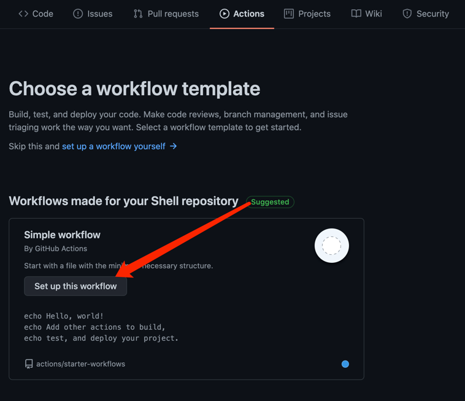
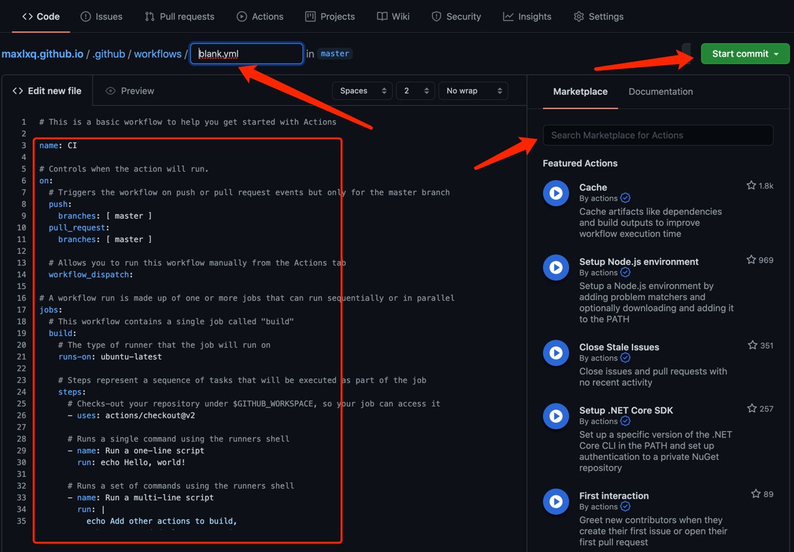
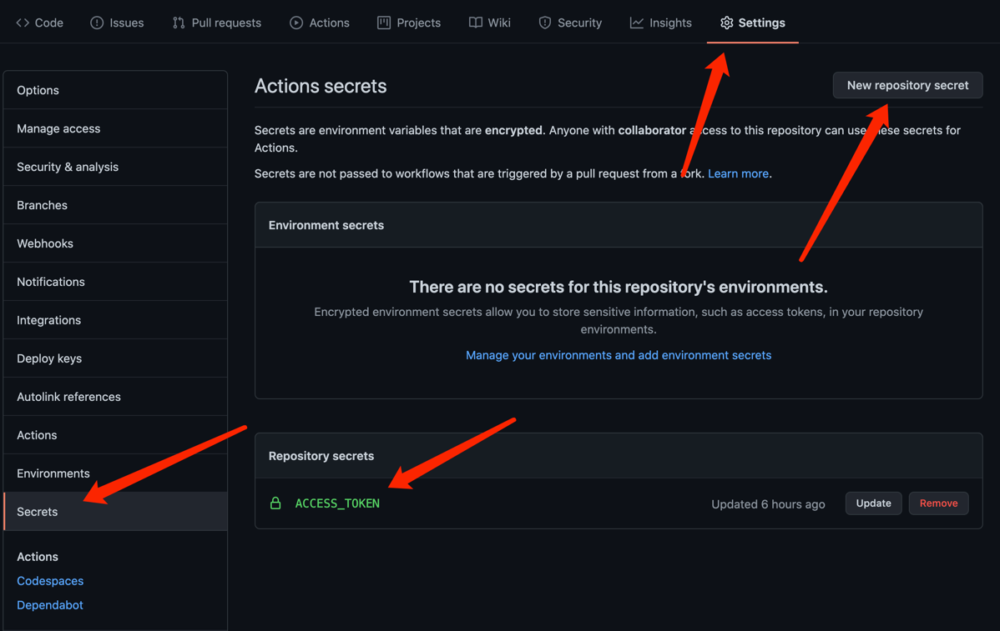
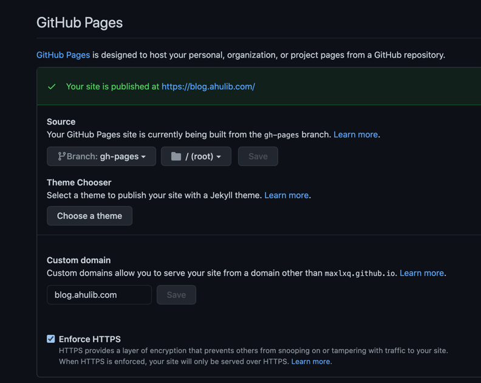

# GitHub-Actions 实践

GitHub Actions 是 GitHub 的 CI/CD 服务，2018 年 10 月推出。

此项目之前没有使用过 GitHub Actions，之前常用的是 自建 Jenkins、Travis-ci 这两种。

## Actions 介绍

### GitHub Actions 是什么

持续集成由很多操作组成，如：拉取代码、运行测试、登录远程服务器、发布等，这些操作归类于 actions。

GitHub 允许开发者将这类操作统一写成独立的脚本文件，存放到代码仓库，使得其他开发者可以引用。

action 是相似的，所以我们完全可以不用编写复杂的脚本，直接引用他人写好的 action 即可。

GitHub 提供了 action 的官方市场，可以搜索到自己需要的 action。[awesome-actions 仓库](https://github.com/sdras/awesome-actions)

## 基本概念

- workflow：工作流程，CI 一次运行的过程，就是一个 workflow
- job：任务，一个 workflow 是由一个或多个 jobs 构成，含义是一次 CI 的运行，可以完成多个任务
- step：步骤，每个 job 由多个 step 构成，一步步完成
- action：动作，每个 step 可以依次执行一个或多个命令

## workflow 文件

启用 GitHub Actions 时，GitHub 网页上会创建 .github/workflows 目录。

workflow 文件采用 YAML 格式文件，统一后缀名 .yml，一个库可以由多个 workflow 文件。

GitHub 只要发现 .github/workflows 目录中有 .yml 文件，就会运行该文件。

### 基本字段
- name：workflow 名称，缺省时，默认为当前 workflow 的文件名
- on：触发条件，如：push、\[push, pull_request], 还可以配置 限定分支或标签
```yaml
# 只有 master 分支发生 push 事件，才会触发 workflow
on:
  push:
    branches:
      - master
```
- jobs: 需要写出每一项的 job_id，名称自定
  - name 字段是任务说明
  - runs-on 虚拟机环境
  - steps 运行步骤

```yaml
jobs:
  job:
    name: job init
    runs-on: ubuntu-latest
  first_job:
    name: fisrt job
    needs: job
  second_job:
    name: second job
    needs: [job1, job2]
```
- steps：包含 name、env、run
```yaml
jobs:
  job:
    name: job init
    runs-on: ubuntu-latest
    steps:
      - name: Checkout
        uses: actions/checkout@master

      - name: Print Test
        env:
          MY_VAR: Hi there! My name is
          FIRST_NAME: Mona
          MIDDLE_NAME: The
          LAST_NAME: Octocat
        run: |
          echo $MY_VAR $FIRST_NAME $MIDDLE_NAME $LAST_NAME.


      - name: build and deploy
        uses: jenkey2011/vuepress-deploy@master
        env:
          # ACCESS_TOKEN: ${{ secrets.ACCESS_TOKEN }}
          TARGET_REPO: maxlxq/maxlxq.github.io
          TARGET_BRANCH: gh-pages
          BUILD_SCRIPT: yarn && yarn build
          BUILD_DIR: docs/.vuepress/dist/
          CNAME: blog.ahulib.com
```

## GitHub 配置

在 GitHub 项目仓库中，找到 Actions Tab 按钮，启用 Actions workflow 功能。

新出现一个页面，需要新创建一个 路径文件：`.github/workflows/<your_ci_name>.yml`，在模版文件中做对应修改，右侧可以搜索一些常用的库，直接根据提示将模版代码复制到文件中即可。




ACCESS_TOKEN 需要去用户的 `Settings => Developer Settings => Personal access tokens` 创建，配置权限有限的 token，注意保存 token，仅出现一次。

配置中出现的 `${{ secrets.ACCESS_TOKEN }}` 则需要在 Settings 中配置，如下：


整体配置结束后，将 vuepress 项目推送到 GitHub 仓库地址 master 分支，GitHub Actions 会自动运行，将构建产物发布到网页。

CNAME 使用自定义域名访问
```yaml
jobs:
  job:
    name: job init
    runs-on: ubuntu-latest
    steps:
      - name: build and deploy
      uses: jenkey2011/vuepress-deploy@master
      env:
        # ACCESS_TOKEN: ${{ secrets.ACCESS_TOKEN }}
        TARGET_REPO: maxlxq/maxlxq.github.io
        TARGET_BRANCH: gh-pages
        BUILD_SCRIPT: yarn && yarn build
        BUILD_DIR: docs/.vuepress/dist/
        CNAME: blog.ahulib.com # <= 左侧设置 CNAME 地址
```
Settings 中配置信息：分支 = TARGET_BRANCH、设置 domain，启用 HTTPS


更多内容详见 [Actions 文档](https://docs.github.com/en/rest/reference/actions)
