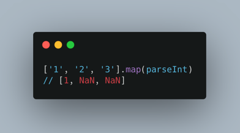
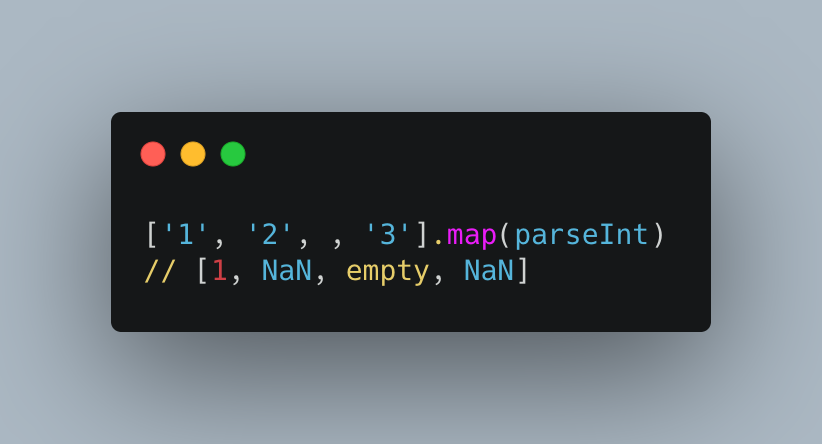
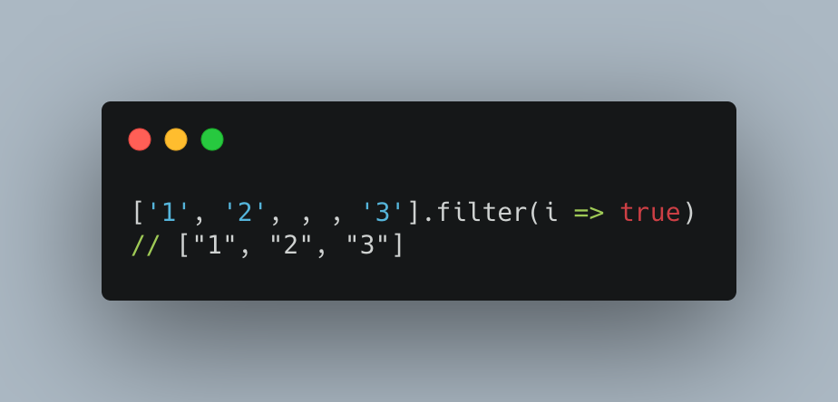

# JS 基础

## 1、['1', '2', '3'].map(parseInt)
```javascript
// parseInt(value[, radix])
// value: 必填，任意值
// radix: 选填，范围为 2 - 32

['1', '2', '3'].map(parseInt)
// ['1', '2', '3'].map(parseInt) 可解释为
// parseInt('1', 0) => 1
// parseInt('2', 1) => NaN
// parseInt('3', 2) => NaN
```


## 2、['1', '2', , '3'].map(parseInt)
```javascript
['1', '2', , '3'].map(parseInt)
// [1, NaN, empty, NaN]
```


## 3、['1', '2', , , '3'].filter(i => true)
```javascript
['1', '2', , , '3'].filter(i => true)
// ['1', '2', '3']
// 数组中 空数据 不会执行 filter 中的方法
```

